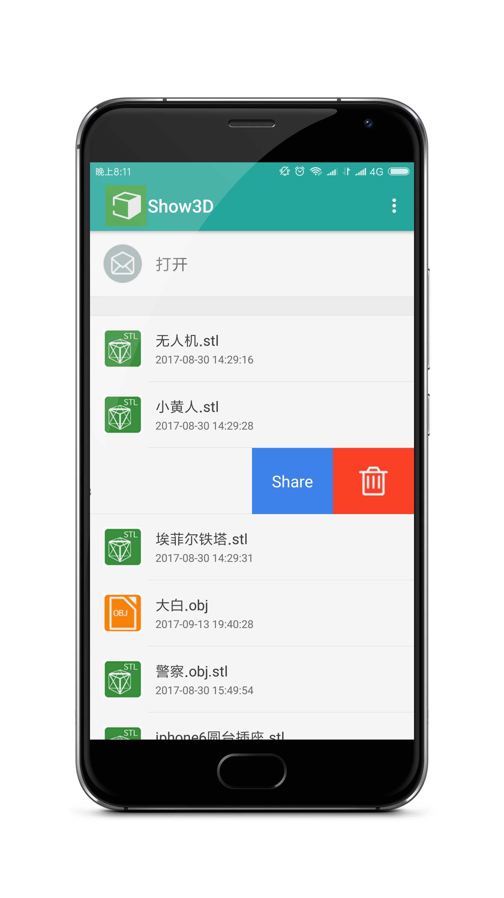
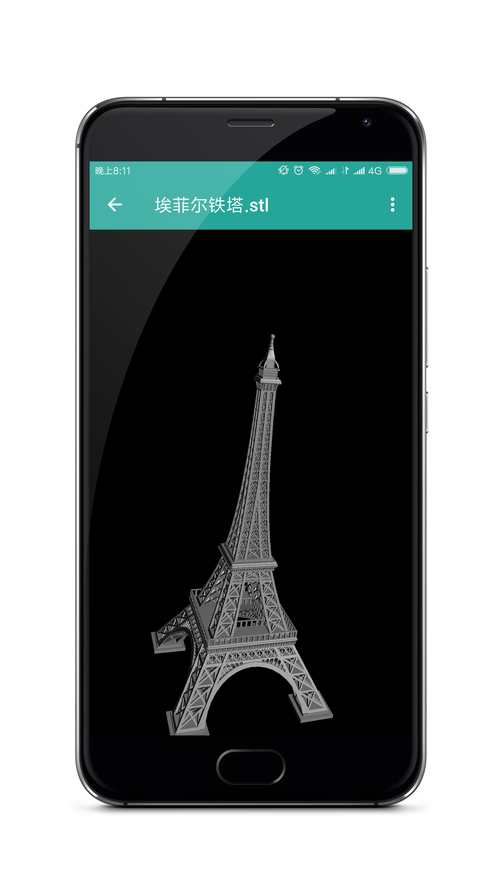
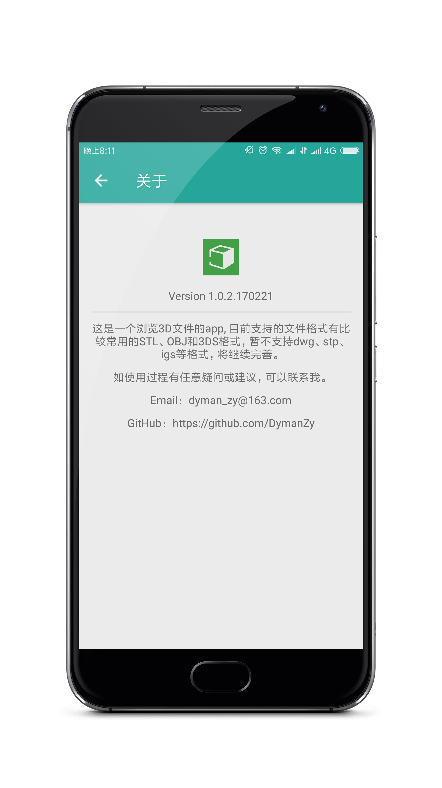
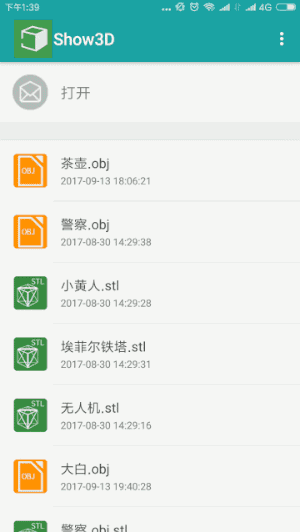

# EasyShow3D
简单易用的3D模型解析库，基于OpenGL ES渲染，支持OBJ、STL和3DS等格式的3D模型文件的解析浏览，同时还支持对模型的旋转和缩放操作。以后还会继续更新，目标是做成一个使用简单、功能齐全的3D模型解析库。欢迎大家star，fork。

## 个人项目(例子)

这是一个浏览3D 模型的 APP,  基于OpenGLES 2.0进行开发，目前支持的3D模型格式有OBJ、STL和3DS 等格式的3D模型文件,  暂不支持 stp、igs 、dwg 等格式，如有这方面的解决方法，请多多指教。
目前在尝试使用多线程解析OBJ模型，但整体效果并不算很好，仍在开发过程中。

[传送门](https://www.pgyer.com/o4n9)

<a href="art/00.jpeg"></a>

这里提供两个[示例模型](model/)

## Screenshots

<a href="art/00.jpeg"></a> <a href="art/01.jpeg"></a> <a href="art/05.jpeg"></a>

#### 模型解析示例

<a href="art/05.jpeg"></a>

## 接入

1.在根目录下的build.gradle添加：

```java
allprojects {
  repositories {
    ...
    maven { url 'https://www.jitpack.io' }
  }
}
```

2.添加依赖

```java
dependencies {
  compile 'com.github.DymanZy:EasyShow3D:1.2'
}
```

## 使用

#### 1.添加解析模型的布局：

```java
<com.dyman.easyshow3d.view.ShowModelView
  android:id="@+id/showModelView"
  android:layout_width="match_parent"
  android:layout_height="match_parent"/>
```

#### 2.设置需要解析的模型

```java
ModelFactory.decodeFile(ShowModelActivity.this, filePath, new ModelLoaderListener() {
  @Override
  public void loadedUpdate(float progress) {
    Log.i(TAG, "模型解析进度： " + progress);
  }

  @Override
  public void loadedFinish(ModelObject modelObject) {
    if (modelObject != null) {
      //  解析完成，显示模型
      showModelView.setModelObject(modelObject);
    }
  }

  @Override
  public void loaderCancel() {
  }
  
  @Override
  public void loaderFailure() {
  }
});
```

其中filePath为模型的文件路径，自动区分Obj、Stl、3ds等格式进行解析，统一通过ModelLoaderListener的三个回调接口返回解析结果。最后通过 showModelView.setModelObject(modelObject) 即可显示模型。

## Instructions

- 如果你有任何意见，bug，问题都可以给我提Issuse，我会第一时间关注并解决。
- 目前还在尝试使用多线程加快OBJ文件的解析速度，敬请期待


## Thanks to the open source project

- [SwipeMenuListView](https://github.com/baoyongzhang/SwipeMenuListView)


## 关于我

- Email：dyman_zy@163.com
- GitHub: [DymanZy](https://github.com/DymanZy)
- 博客: [dyman's blog](https://dymanzy.github.io/)

## License

```
Copyright 2017 dyman

Licensed under the Apache License, Version 2.0 (the "License");
you may not use this file except in compliance with the License.
You may obtain a copy of the License at

   http://www.apache.org/licenses/LICENSE-2.0

Unless required by applicable law or agreed to in writing, software
distributed under the License is distributed on an "AS IS" BASIS,
WITHOUT WARRANTIES OR CONDITIONS OF ANY KIND, either express or implied.
See the License for the specific language governing permissions and
limitations under the License.
```