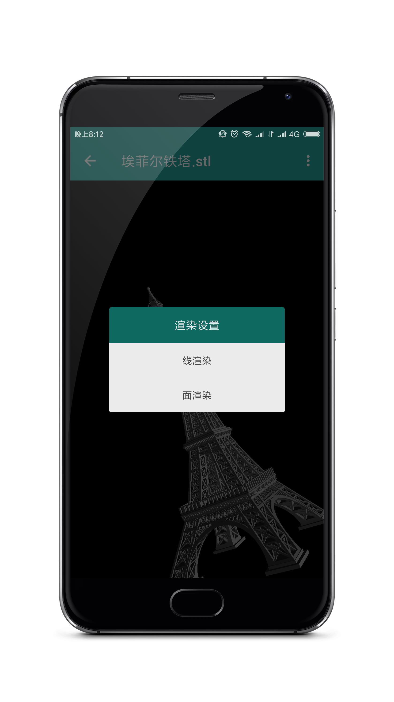
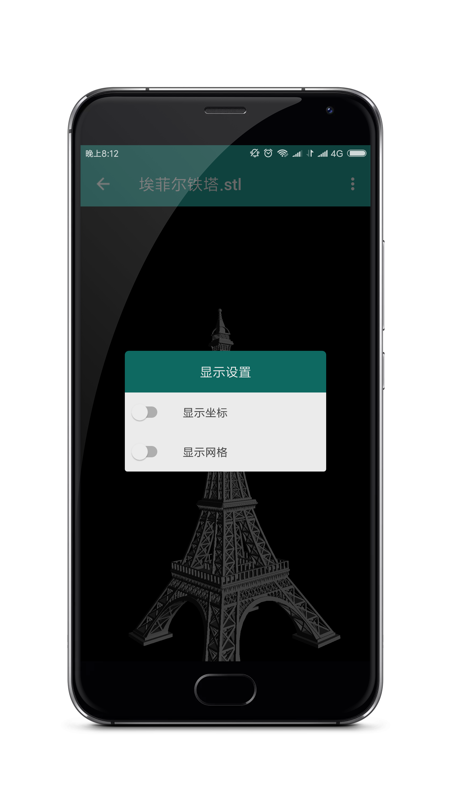
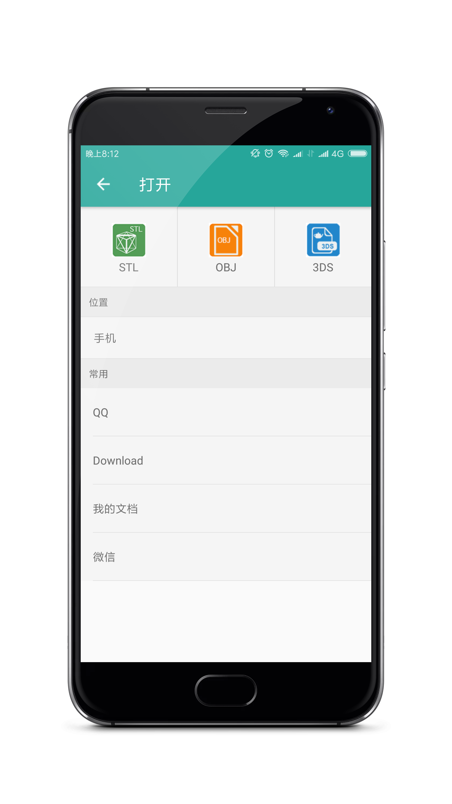

# Show3D
#### 个人项目

这是一个浏览3D 模型的 APP,  基于OpenGLES 2.0进行开发，目前支持的3D模型格式有OBJ、STL和3DS 等格式的3D模型文件,  暂不支持 stp、igs 、dwg 等格式，如有这方面的解决方法，请多多指教。
目前在尝试使用多线程解析OBJ模型，但整体效果并不算很好，仍在开发过程中。

## Screenshots

  

  

## Instructions

- 如果你有任何意见，bug，问题都可以给我提Issuse，我会第一时间关注并解决。
- 后期会抽时间使用 MVP 来重构该项目， 让整体架构更清晰。

## Statement

该项目仅供交流学习使用。

## Thanks to the open source project

- [SwipeMenuListView](https://github.com/baoyongzhang/SwipeMenuListView)

### End

